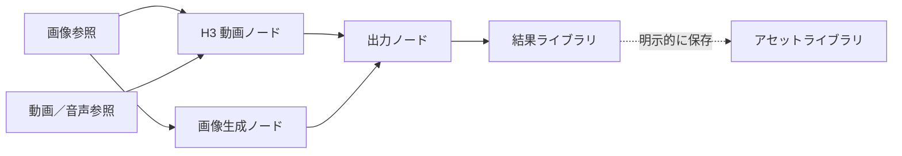
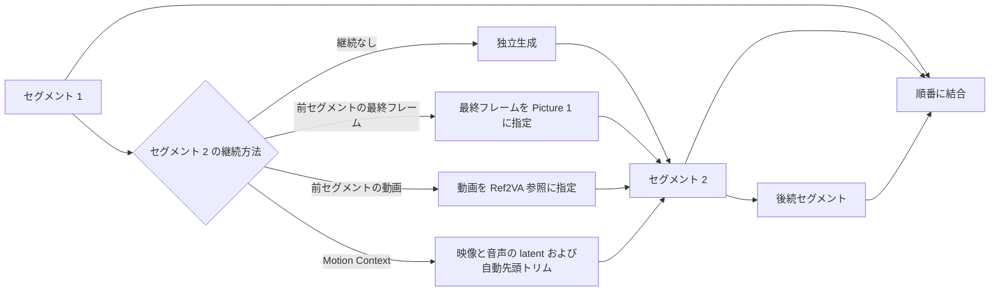

# MiniMax H3 Video Studio

<p align="center">
  <a href="README.md">English</a> · <a href="README.zh-CN.md">简体中文</a> · 日本語
</p>

<p align="center">
  <strong>Agent 対応の動画・画像・音声変換ワークスペース</strong>
</p>

<p align="center">
  MiniMax H3 動画 · Qwen-Image 2.1 BF16 · 音声変換 · UI + h3ctl CLI
</p>

<p align="center">
  <a href="#3-ステップで起動">3 ステップで起動</a> ·
  <a href="docs/installation.md">インストールガイド</a> ·
  <a href="docs/h3-prompt-guide.md">H3 プロンプトガイド</a> ·
  <a href="docs/long-video.md">長尺動画ガイド</a> ·
  <a href="docs/releasing.md">リリース規約</a>
</p>

MiniMax H3 Video Studio は、動画・画像・音声変換を扱うセルフホスト型ワークスペースです。ブラウザには永続化できるノードキャンバス、MiniMax H3 動画、複数の画像モデル、音声変換画面があります。Agent は `h3ctl` CLI から同じバックエンドを直接操作でき、永続ジョブ ID と JSON/JSONL の結果を受け取れます。ComfyUI はローカルまたはリモート GPU で実行できます。

> MiniMax H3 Video Studio は独立したコミュニティプロジェクトであり、MiniMax または ComfyUI との提携・公認関係はありません。

> 従来の画面は公開を許可されたデモ素材を使用しています。Qwen-Image 2.1 と音声変換の画面は、ユーザー素材を含まないクリーンなデモ環境です。元の素材、モデルの重み、生成ファイルはリポジトリに含まれません。

<p align="center">
  
</p>



## 生成結果のプレビュー

以下の軽量アニメーションは、MiniMax H3 Video Studio で生成した 9:16、15.08 秒、音声付き動画のうち、有効な映像が始まってからの連続 5 秒を切り出したものです。公開しているのは無音のアニメーションだけで、完全な生成ファイルはリポジトリに含まれません。

[](docs/assets/readme/generated-video-preview.gif?raw=1)

[アニメーションが表示されない場合は、元の GIF を直接開いてください。](docs/assets/readme/generated-video-preview.gif?raw=1)

## 主な機能

### ノードキャンバス

- 画像、動画、音声の参照ノードと、H3 動画、画像生成、出力ノードを 1 枚のキャンバス上で構成できます。
- `@` を入力して現在のノード素材を参照します。接続線と明示的に選択したモードから、実際に実行するワークフローが決まります。
- 画像編集、動画クリップ、フレーム抽出は新しい結果ノードを作成し、アセットライブラリへ自動登録しません。再利用したい場合だけ、ノードのコンテキストメニューからアセットへ保存します。
- ローカルの画像、動画、音声をキャンバスへドラッグできます。ノード内のメディアをローカルアップロードと誤認することはありません。
- 更新後もキャンバス、アセット、タスクの状態を復元でき、結果のプレビューとダウンロードに対応します。

### 7 種類の動画制作モード

<p align="center">
  
</p>

| モード | 用途 | 入力条件 |
| --- | --- | --- |
| `Auto` | ノード接続に応じてワークフローを自動選択 | 素早い構成に最適 |
| `T2V` | テキストから動画を生成 | テキストプロンプトのみ |
| `I2V` | 1 枚の画像から動画を生成 | 開始画像 1 枚 |
| `FL2V` | 最初と最後のフレームから動画を生成 | 端点画像 1～2 枚 |
| `R2V` | マルチモーダル参照から動画を生成 | 画像 9 件、動画 3 件、音声 3 件まで。混在時は合計 12 ファイルまで |
| `V2V` | 元動画をリメイク | 元動画を明示的に 1 件選択 |
| `RV2V` | 元動画 + マルチモーダル参照 | 元動画と追加参照を別々に紐付け |

H3 動画は 16:9、9:16、24 FPS に対応します。長さは実際の `17k+5` フレームグリッドに従い、124～362 フレーム、約 5.17～15.08 秒です。サンプリングには Turbo LoRA または公式ベース Profile を選択できます。画面には解決済みのモデル、サンプラー、ステップ数、LoRA、スケジューラーパラメータが表示され、ワークフローのプレビューを実際のタスク実行証拠として扱うことはありません。

### 複数モデルによる画像生成／編集

<p align="center">
  
</p>

<p align="center">
  
</p>

| モデル／ワークフロー | 対応方式 | 適した用途 |
| --- | --- | --- |
| Z-Image Turbo BF16 / INT8 | テキスト画像生成、実験的な単一画像 latent img2img | 高速な写実表現と中国語／英語テキスト。BF16 は標準の高画質設定 |
| Z-Image Turbo + コミュニティ LoRA | テキスト画像生成、実験的な単一画像 latent img2img | モデルに紐付いたパラメータを監査できる独立 Profile |
| Qwen-Image 2512 | 高品質なテキスト画像生成 | ポートレート、自然なディテール、文字レイアウト |
| Qwen-Image Edit 2511 | 指示による単一画像編集 | 主体を維持しながら背景、服装、局所的な意味を変更 |
| Qwen-Image 2.1 BF16 | テキスト画像生成、順序付き画像 1～10 枚の指示編集 | ネイティブ 2K。BF16 重みを暗黙に量子化しない |
| FLUX.2 Klein 4B / 9B | テキスト画像生成、順序付き画像参照 1～4 枚 | 複数画像の人物、服装、シーン、スタイルの組み合わせ |
| Anything V5 | Checkpoint によるテキスト画像生成／画像変換 | 互換性フォールバック |

画像生成は 1K/2K と 16:9、9:16、3:4、1:1 に対応します。Qwen-Image 2.1 はネイティブ 2K サイズ、標準 40 ステップ／CFG 1 を使用し、参照なしならテキスト生成、1～10 枚なら指示編集になります。`<image1>`、`<image2>` で参照順を指定できます。重みの [Qwen Research License](https://github.com/QwenLM/Qwen-Image-2.1/blob/main/LICENSE) は非商用の研究・評価向けで、商用利用には別途許諾が必要です。未公開の Z-Image-Edit は利用不可として表示し、latent img2img を指示編集と偽りません。詳細は [画像ワークフロー文書](docs/image-workflows.md) を参照してください。

### 音声変換と楽曲カバー

<p align="center">
  
</p>

音声画面はドラッグ＆ドロップ、既存アセット、マイク録音に対応し、録音を元音声または参照音声に指定できます。Vevo2 FM-only は参照音色への変換、YingMusic-SVC はボーカル分離・変換・伴奏リミックスを実行します。後者はステップ数、ガイダンス、乱数シードを調整でき、完成ミックス・変換後のドライボーカル・伴奏を個別に試聴／書き出しできます。エコーとリバーブは別々に切り替えられ、動画・画像タスクと GPU の排他キューを共有します。Agent は `h3ctl voice convert` と `h3ctl voice download` から同じ機能を使用できます。

RTX 5090 で BF16 重みを使用した実測例では、Qwen-Image 2.1 の 2048 × 2048・40 ステップ生成が約 75 秒、指示編集が約 120 秒で完了しました。同じ検証用ゲートウェイから CLI の生成と編集も完了しています。完了済み YingMusic タスクでは、ミックス・ドライボーカル・伴奏それぞれの試聴とダウンロードがバイト単位で一致しました。速度は保証値ではなく、生成メディアやユーザー音声はリポジトリに含めません。

### 長尺動画：分割生成と継続

長尺動画ワークスペースでは、既存動画と生成待ちのセグメントを同じタイムラインに配置できます。プレビュー、分割、イン／アウト点の調整、空白セグメントの作成に加え、選択したセグメントまたは依存順での実行に対応します。

<p align="center">
  
</p>

各生成待ちセグメントは、独立生成、前セグメントの最終フレームからの継続、前セグメントの動画を Ref2VA 参照として使う方法、または Motion Context で前セグメントの H3 映像／音声 latent を引き継ぐ方法を選べます。継続設定、アスペクト比、有効時間、サンプリング Profile、LoRA 強度、ステップ数、Seed はプロジェクトとともに保存されます。

<p align="center">
  
</p>



- 各セグメントは約 5.17～15.08 秒に対応します。失敗したセグメントは再実行でき、上流の変更時には依存する下流セグメントを無効化して再計算できます。
- 完成した 362 フレームのセグメントを次の動画参照に使う場合、システムが派生させた 15 秒の参照コピーだけを切り詰めます。最終結合では完全なセグメントを使用します。
- Motion Context は Base と Turbo LoRA の両 Profile に対応し、Profile の許容範囲内で指定したステップ数を維持し、結合前に再利用された先頭フレームを自動で除去します。latent で接続する隣接セグメントは同じ出力サイズである必要があります。
- トップレベルの「復刻ワークショップ」は 15〜60 秒の元動画、設定、保持項目、置換対象、任意の画像参照を受け取ります。シーンを解析し、15.08 秒以下の H3 セグメントに変換し、結合後に元の正確な長さまでトリムします。
- `h3ctl video migrate-character` は、実用上長さ無制限の元動画で明示的に指定した 1 人を別のキャラクターに置き換えます。24 FPS の正確な範囲と Motion Context を使用し、末尾ウィンドウは先に戻して対応可能な重複を増やし、グリッド上不可避な場合だけ最小限パディングします。音声は `copy-source`、`reference-source`、`generate`、`mute` から選べます。
- 結合には FFmpeg による監査可能なハードカットを使用します。自動で継ぎ目のない映像／音声接続を実現するとは表明しません。
- `h3ctl video compose` でパイプライン全体を実行でき、プロジェクト、トリム、結合の各原子コマンドも個別に利用できます。完全な仕様は [長尺動画文書](docs/long-video.md) と [Motion Context 動画合成](docs/motion-context-long-video.md) を参照してください。

### アセット／結果管理

- 画像、動画、音声のアセットをキャンバス間で再利用でき、検索、フォルダー、ピン留め、複数選択、一括削除に対応します。
- フォルダーを削除しても、フォルダー自体だけが削除されます。中のアセットと子フォルダーは自動的に親階層へ移動するため、メディアを誤って削除しません。
- 生成結果と編集による派生結果をまとめて表示し、ピン留め、種類をまたぐ複数選択、現在の表示項目の全選択、一括削除、プレビュー、ダウンロードに対応します。
- 同一内容の素材は SHA-256 により再利用し、画面上でもまとめて表示することで、重複アップロードとストレージ使用量を削減します。

### Agent 自動化向け Go CLI

`h3ctl` は、アセット転送、画像／動画生成、再開可能な待機、メディア派生、長尺動画、長さ無制限のキャラクター移行を安定した原子コマンドとして提供します。`video.character_migration.plan`、`video.character_migration.produce`、`media.mux_audio` は Agent 向けの厳密な Draft 2020-12 契約です。CLI はローカルファイル、リモートアセット locator、SSH context、JSON/JSONL 出力を利用できます。詳細は [Go CLI ガイド](docs/cli.md) を参照してください。

```bash
h3ctl video compose --spec trilogy.json --to final.mp4 --timeout 0
h3ctl video replicate --source source.mp4 --brief "動きを保持し、人物と製品を置換" \
  --reference character.png --to replicated.mp4
h3ctl video migrate-character --source performance.mp4 --character hero.png \
  --source-subject "画面中央のダンサー" --steps 4 --to migrated.mp4
```

リポジトリには、[`H3 プロンプトコンパイラー`](skills/h3-ref2va-prompt-compiler/SKILL.md)、[`H3 キャラクター会話動画`](skills/h3-character-dialogue-video/SKILL.md)、[`H3 ダンス再現`](skills/h3-dance-replication/SKILL.md)、[`H3 長尺キャラクター移行`](skills/h3-character-migration/SKILL.md) の 4 つのローカル Skill が付属しています。

## 3 ステップで起動

> [!IMPORTANT]
> ワンコマンドスクリプトは、ロックされた Node 依存関係のインストール、フロントエンドのビルド、サービスの起動を行います。Python、Node.js、FFmpeg、ComfyUI、カスタムノード、モデルをシステムへインストールするものではありません。新しいマシンでは、先に [完全なインストール／運用ガイド](docs/installation.md) を確認してください。

必要環境：

- Node.js `>=22.13`
- Python `>=3.11`
- npm、`ffmpeg`、`ffprobe`
- 選択した Profile に必要なノードとモデルを備え、接続可能な ComfyUI
- 任意：`scenedetect>=0.6.4,<0.8`。未導入の場合、スマートシーン分割は FFmpeg へ自動フォールバックします

プロジェクトルートで実行します：

1. 設定をコピーし、ComfyUI URL、データディレクトリ、モデルファイル名を確認します。loopback または SSH トンネルで使う場合、API Key は不要です。公開配置で認証を明示的に有効化しない限り、両方の Key は空のままにします。

   ```bash
   cp .env.example .env.local
   # エディターで .env.local を編集
   ```

2. ロックされた Node 依存関係をインストールし、本番ビルドを作成します。

   ```bash
   python3 scripts/h3studio.py install
   ```

3. 依存関係と ComfyUI を確認してから、API と本番フロントエンドを起動します。

   ```bash
   python3 scripts/h3studio.py doctor --check-comfy
   python3 scripts/h3studio.py start
   ```

`http://127.0.0.1:3013` を開きます。`start` はフロントエンドとバックエンドの両方を監視し、片方が終了した場合はもう片方も停止します。`Ctrl-C` で両方を正常に終了できます。

### 管理コマンド

```bash
# 確認のみ。システムは変更しない
python3 scripts/h3studio.py doctor

# インストール／起動コマンドを実行せずに表示
python3 scripts/h3studio.py install --dry-run
python3 scripts/h3studio.py start --dry-run

# ポートを指定。3 つのポートはすべて異なる値にする
python3 scripts/h3studio.py start --port 3013 --internal-port 3014 --api-port 6020
```

`doctor` は Python、Node.js、npm、FFmpeg/FFprobe、プロジェクトファイル、フロントエンドの依存関係／ビルド、API Key の接続を確認します。`--check-comfy` を付けると ComfyUI の `/system_stats` も確認します。依存関係のダウンロードは行わず、すべての Profile に必要なノードとモデルが揃っていることまでは保証できません。起動後は `/api/capabilities` と画面の利用可否メッセージを正として確認してください。同等の npm コマンドは `npm run doctor`、`npm run install:studio`、`npm run start:studio` です。

## ローカル開発

```bash
npm ci
cp .env.example .env.local

# ターミナル A：API
set -a && source .env.local && set +a
python3 -m server

# ターミナル B：フロントエンド。/api は 6020 へプロキシ
set -a && source .env.local && set +a
npm run dev -- --host 127.0.0.1 --port 3013
```

API Key を有効にする場合は、同じ値をサーバー側の `H3_STUDIO_API_KEY` とフロントエンドプロキシプロセスの `H3_STUDIO_PROXY_API_KEY` にだけ設定します。キーがブラウザバンドルへ入ることはありません。

## AutoDL／リモートアクセス

既定では、API、内部フロントエンド、公開入口はいずれも loopback のみで待ち受けます。リモートマシンでサービスを起動した後、ローカルで SSH トンネルを作成します。

```bash
# リモートマシン
python3 scripts/h3studio.py start

# ローカルマシン：同一オリジンのフロントエンド入口だけを転送
ssh -N -L 16020:127.0.0.1:3013 -p <PORT> <SSH_USER>@<HOST>
```

`http://127.0.0.1:16020` を開きます。トンネルを省くためだけに `0.0.0.0` を公開しないでください。公開アクセスが必要な場合は、ファイアウォール、TLS リバースプロキシ、強力な API Key を構成してください。モデル、素材、生成結果、API Key、SSH パスワードを Git にコミットしてはいけません。

## 主な設定

[`.env.example`](.env.example) を基準にしてください。`h3studio.py` はプロジェクトルートの `.env.local` を自動で読み込みます。`--env-file <path>` で別のファイルも指定でき、既存プロセスの環境変数が優先されます。

| 変数 | 用途 |
| --- | --- |
| `COMFY_URL` | ComfyUI の HTTP アドレス |
| `H3_STUDIO_HOST` / `H3_STUDIO_PORT` | Python API の待受アドレス／ポート。既定値は `127.0.0.1:6020` |
| `H3_STUDIO_WEB_HOST` / `PORT` / `H3_STUDIO_INTERNAL_WEB_PORT` | 公開フロントエンドのアドレス、公開ポート、内部ポート |
| `H3_STUDIO_DATA_ROOT` | アセット／タスクメタデータのディレクトリ。リモート環境ではデータボリュームを推奨 |
| `H3_STUDIO_COMFY_INPUT` / `H3_STUDIO_COMFY_OUTPUT` | ComfyUI の入力／出力ディレクトリ |
| `H3_STUDIO_*_MODEL` / `H3_STUDIO_*_LORA` | モデル Profile が使用するファイル名 |
| `H3_STUDIO_API_KEY` / `H3_STUDIO_PROXY_API_KEY` | 公開配置で任意に使う同一値のキー。loopback／SSH 利用時は両方とも空欄 |
| `H3_STUDIO_COMFY_IDLE_FREE_SECONDS` | ComfyUI のグローバルキューがアイドルになってから `/free` を呼ぶまでの秒数。`0` で無効化 |
| `H3_STUDIO_MAX_ASSET_STORAGE_BYTES` | アセットストレージ上限 |
| `H3_STUDIO_MAX_MOTION_CONTEXT_STORAGE_BYTES` | Motion Context latent 永続ストレージ上限 |
| `H3_STUDIO_MAX_ACTIVE_JOBS` | アクティブタスク上限 |
| `H3_STUDIO_MAX_PROJECT_JSON_BYTES` | 長尺動画プロジェクト定義の上限。既定値は 32 MiB |
| `H3_STUDIO_ASSET_TTL_DAYS` | 管理者が手動でガベージコレクションを実行する際の既定保持日数 |

外部 Profile は `H3_STUDIO_DATA_ROOT/profiles/*.json` に配置します。マニフェストから選択できるのは、コード上でレビュー済みのワークフローコンパイラーだけです。新しい種類にはアダプターとテストが必要で、マニフェストから任意の ComfyUI graph、パス、コマンドを実行することはできません。変数、モデルディレクトリ、トラブルシューティングの詳細は [インストールガイド](docs/installation.md) を参照してください。

## プロジェクト構成

```text
app/       React ノードキャンバス／ワークスペース UI
server/    Python 標準ライブラリ API、ストレージ、タスク、ComfyUI ワークフローコンパイル
scripts/   インストール、起動、診断、長尺動画、運用ツール
skills/    付属する H3 プロンプ生成と制作 Skills
docs/      インストール、アーキテクチャ、モデルワークフロー、リリース規約、LLM コードマップ
tests/     フロントエンドのビルド、レンダリング、ソース契約テスト
```

開発に参加する前に [AGENTS.md](AGENTS.md) と [LLM Wiki](docs/llm-wiki.md) を確認してください。ユーザー向けの変更は [Changelog](CHANGELOG.md) に記録しています。LLM Wiki は現在の実装をたどるための入口です。

## テスト

```bash
npm test
```

このコマンドは ESLint、TypeScript チェック、本番ビルド、レンダリングテスト、Python の単体／API／長尺動画／運用テストを順番に実行します。

## 機能上の境界

MiniMax H3 Video Studio は、ローカルの H3-Base 768p を公式未公開の Context-IR/2K パイプラインとして扱いません。また、いわゆる「公式 NSFW スイッチ」やモデレーション回避機能も提供しません。運用者は合法な成人向けコンテンツにローカルモデルポリシーを設定できますが、未成年者、同意のない親密なコンテンツ、実在人物を無断で用いた性的ディープフェイク、違法行為、権利侵害に関わるコンテンツは拒否しなければなりません。

H3 のスケジューラーノイズ除去率は `BasicScheduler.denoise` に直接対応し、CFG、LoRA 強度、または実証済みの参照保持ウェイトではありません。モデル、ノード、ライセンスの正確な情報は `/api/capabilities`、[画像ワークフロー](docs/image-workflows.md)、各タスクに保存された証拠を参照してください。
