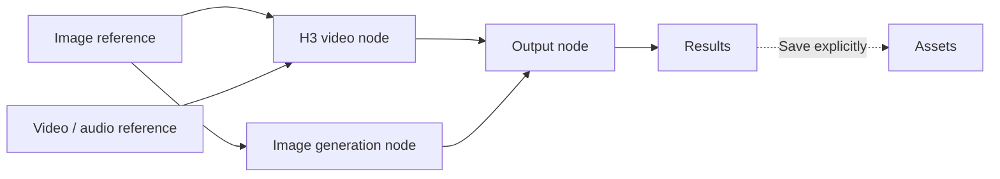
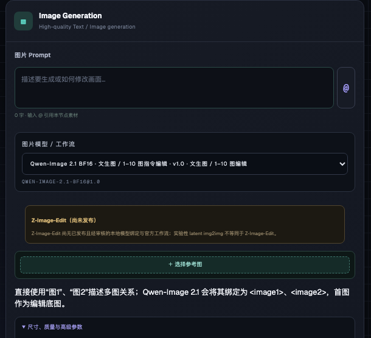
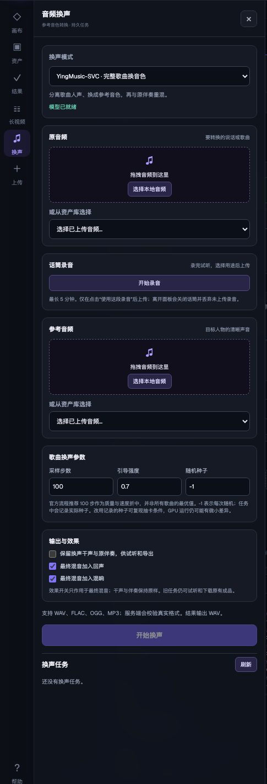
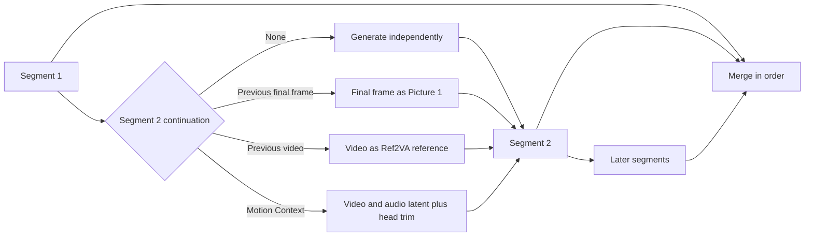

# MiniMax H3 Video Studio

<p align="center">
  English · <a href="README.zh-CN.md">简体中文</a> · <a href="README.ja.md">日本語</a>
</p>

<p align="center">
  <a href="https://github.com/siyuan-liu31/minimax-h3-video-studio/stargazers"></a>
  <a href="https://github.com/siyuan-liu31/minimax-h3-video-studio/releases/latest"></a>
  
  
</p>

<p align="center">
  <strong>An Agent-friendly AI video, image, and voice workspace</strong>
</p>

<p align="center">
  MiniMax H3 video · Qwen-Image 2.1 BF16 · Voice conversion · Visual studio + h3ctl CLI
</p>

<p align="center">
  <a href="#start-in-three-steps">Start in three steps</a> ·
  <a href="docs/installation.md">Installation guide</a> ·
  <a href="docs/h3-prompt-guide.md">H3 prompt guide</a> ·
  <a href="docs/long-video.md">Long video guide</a> ·
  <a href="docs/releasing.md">Release policy</a>
</p>

MiniMax H3 Video Studio is a self-hosted creation workspace for video, images, and voice. Its visual interface combines a persistent node canvas, MiniMax H3 video workflows, multiple image models including Qwen-Image 2.1, and a dedicated voice-conversion workspace. The Agent-friendly `h3ctl` CLI exposes the same backend through composable commands and versioned operations, with durable job IDs and JSON/JSONL receipts. Run ComfyUI locally or on a remote GPU.

> MiniMax H3 Video Studio is an independent community project. It is not affiliated with or endorsed by MiniMax or ComfyUI.

> Earlier screenshots use demo media approved by the user for public display; the Qwen-Image 2.1 and voice-panel screenshots use a clean demo workspace with no user media. The repository does not include original media, model weights, or generated video files.

<p align="center">
  
</p>



## Why MiniMax H3 Video Studio?

| Need | A raw ComfyUI workflow | MiniMax H3 Video Studio |
| --- | --- | --- |
| Reusable creative projects | Reopen and rewire individual graphs | Persistent multi-canvas workspace with assets and results |
| MiniMax H3 generation modes | Manually change graph inputs | Explicit T2V, I2V, FL2V, R2V, V2V, and RV2V modes |
| Long-running generations | Keep a browser or script attached | Durable job IDs, reconnectable waiting, cancellation, and resumable sampling |
| Local and rented GPUs | Manage endpoints and file transfer yourself | Same-origin web gateway plus reusable direct or SSH CLI contexts |
| Agent automation | Build custom API calls | Stable `h3ctl` commands with JSON/JSONL receipts and atomic media operations |
| Song and speech voice conversion | Separate tools and ad-hoc files | Upload/record in the UI or use `h3ctl voice`; preview and download completed tracks |

## Generated result preview

This lightweight animation is a five-second excerpt, beginning at the first usable frame, from a 9:16, 15.08-second video with audio generated by MiniMax H3 Video Studio. Only the silent animation is public; the complete generated file is not included in the repository.

[](docs/assets/readme/generated-video-preview.gif?raw=1)

[Animation not visible? Open the original GIF directly.](docs/assets/readme/generated-video-preview.gif?raw=1)

> If MiniMax H3 Video Studio helps your workflow, please consider giving the repository a Star. It helps more ComfyUI and AI-video creators discover the project.

## Core capabilities

### Node canvas

- Compose image, video, and audio references with H3 video, image generation, and output nodes on one canvas.
- Type `@` to reference media from the current node. Connections and the explicit mode together determine the workflow that actually runs.
- Image edits, video clips, and extracted frames create new result nodes instead of entering the asset library automatically. Save them to Assets from the node context menu only when you want to reuse them.
- Drag local images, videos, and audio onto the canvas. Media already inside a node is never mistaken for a local upload.
- Restore canvas, asset, and task state after a refresh, and preview or download results.

### Seven video creation modes

<p align="center">
  
</p>

| Mode | Purpose | Input constraint |
| --- | --- | --- |
| `Auto` | Select a workflow from node connections | Best for quick composition |
| `T2V` | Text to video | Text prompt only |
| `I2V` | Single-image to video | One starting image |
| `FL2V` | First-and-last-frame to video | One or two endpoint images |
| `R2V` | Multimodal reference to video | Up to 9 images, 3 videos, and 3 audio files; 12 files combined |
| `V2V` | Source video remake | Exactly one source video selected explicitly |
| `RV2V` | Source video plus multimodal references | Source video and additional references are bound separately |

H3 video supports 16:9, 9:16, and 24 FPS. Duration follows the actual `17k+5` frame grid: 124–362 frames, or about 5.17–15.08 seconds. Sampling can use either a Turbo LoRA or an official base profile. The interface shows the resolved model, sampler, step count, LoRA, and scheduler parameters; a workflow preview is never presented as evidence that a job actually ran.

### Multi-model image generation and editing

<p align="center">
  
</p>

<p align="center">
  
</p>

| Model / workflow | Supported operation | Best suited for |
| --- | --- | --- |
| Z-Image Turbo BF16 / INT8 | Text to image; experimental single-image latent img2img | Fast photorealism and Chinese/English text; BF16 is the default high-quality option |
| Z-Image Turbo + community LoRA | Text to image; experimental single-image latent img2img | Separate, auditable profiles with model-bound parameters |
| Qwen-Image 2512 | High-quality text to image | Portraits, natural detail, and text layout |
| Qwen-Image Edit 2511 | Instruction-based single-image editing | Preserve the subject while changing a background, clothing, or local semantics |
| Qwen-Image 2.1 BF16 | Text to image; one to ten ordered image edits | Native 2K generation and instruction edits without silent weight quantization |
| FLUX.2 Klein 4B / 9B | Text to image; one to four ordered image references | Combining people, clothing, scenes, and styles across images |
| Anything V5 | Checkpoint text to image / image to image | Compatibility fallback |

Image generation supports 1K/2K and 16:9, 9:16, 3:4, and 1:1. Qwen-Image 2.1 uses its native 2K presets, default 40 steps / CFG 1, and one BF16 Profile for text-to-image and instruction editing. Describe multi-image relationships with `<image1>`, `<image2>` (or “图1”, “图2”); references are bound in slot order. Its weights use the [Qwen Research License](https://github.com/QwenLM/Qwen-Image-2.1/blob/main/LICENSE): non-commercial research/evaluation only unless separately licensed. The unreleased Z-Image-Edit capability remains visibly unavailable and is not misrepresented by latent img2img. See [Image Workflows](docs/image-workflows.md) for licenses and exact workflow contracts.

### Voice conversion and song covers

<p align="center">
  
</p>

The Voice workspace accepts drag-and-drop uploads, existing audio assets, or a browser microphone recording. Recordings can be assigned explicitly as either the source or the voice reference. Vevo2 FM-only changes a speech/voice recording toward the reference timbre. YingMusic-SVC performs the full song workflow—vocal separation, timbre conversion, and accompaniment remix—with adjustable steps, guidance, and seed for repeatable variants. Select stem retention, echo, and reverb before submitting the task. Its final mix, converted dry vocal, and accompaniment can then be previewed and exported individually; changing effects after completion requires a new task. The preview and downloaded track use the same persisted result. Jobs share one GPU lease queue with video and image generation and remain cancellable and recoverable.

```bash
h3ctl voice convert ./speech.wav --reference ./voice-reference.wav --engine vevo2
h3ctl voice convert ./song.wav --reference ./voice-reference.wav --engine yingmusic \
  --steps 75 --cfg 0.9 --seed 42 --keep-stems --echo=false --reverb=false
h3ctl voice download TASK_ID --track mix --to ./cover.wav
h3ctl voice download TASK_ID --track dry_vocal --to ./dry-vocal.wav
```

Verified on an RTX 5090 with full BF16 weights: a 2048 × 2048, 40-step Qwen-Image 2.1 text-to-image run completed in 75 seconds, and a 2048 × 2048, 40-step instruction edit completed in 120 seconds. The same staged backend also completed CLI text-to-image and image-to-image jobs through its public gateway. For voice, an existing completed YingMusic task returned byte-identical WAV content from the preview and download endpoints for all three tracks. These are measured example runs, not performance guarantees; generated media and user audio remain outside the repository.

### Long video: segmented generation and continuation

The Long Video workspace places existing footage and pending generated segments on one timeline. You can preview, split, adjust in/out points, create empty segments, and run selected segments or their dependency order.

<p align="center">
  
</p>

Each pending segment can run independently, continue from the previous segment's final frame, use the previous video as a Ref2VA reference, or carry the prior H3 video/audio latent through Motion Context. Continuation settings, aspect ratio, effective duration, sampling profile, LoRA strength, step count, and seed are saved with the project.

<p align="center">
  
</p>



- Each segment supports about 5.17–15.08 seconds. Failed segments can be rerun; upstream changes invalidate dependent downstream segments so they can be recalculated.
- When a finished 362-frame segment becomes the next segment's video reference, only a system-derived 15-second reference copy is trimmed. The final merge still uses the complete segment.
- Motion Context supports both Base and Turbo LoRA Profiles, preserves the requested Profile-bounded step count, and automatically removes reused head frames before concatenation. Adjacent latent-linked segments must keep the same output dimensions.
- `h3ctl video migrate-character` replaces one explicitly identified performer across a source video of arbitrary practical length. It plans exact 24 FPS windows, carries video/audio latent state through Motion Context, increases the final supported overlap to backfill the terminal window before using any unavoidable padding, and applies `copy-source`, `reference-source`, `generate`, or `mute` audio policy.
- FFmpeg performs an auditable hard-cut merge. MiniMax H3 Video Studio does not claim automatic seamless audio/video transitions.
- Run the full pipeline with `h3ctl video compose`, or use the atomic project/trim/concat commands separately. See [Long Video](docs/long-video.md) and [Motion Context composition](docs/motion-context-long-video.md) for the complete contracts.

### Asset and result management

- Reuse image, video, and audio assets across canvases, with search, folders, pinning, multi-select, and bulk deletion.
- Deleting a folder removes only the folder. Its assets and child folders move to the parent automatically, so media is not deleted by mistake.
- Browse generated and derived editing results together, with pinning, mixed multi-select, select-all for the current view, bulk deletion, preview, and download.
- Identical content is reused by SHA-256 and collapsed in the interface, reducing duplicate uploads and storage.

### Go CLI for Agent automation

`h3ctl` exposes stable atomic commands for asset transfer, image/video generation, voice conversion, resumable waiting, media derivation, long-video projects, and character migration. Agents can use its strict Draft 2020-12 operation contracts and structured JSON/JSONL receipts without driving the browser. The same jobs and media remain available in the frontend. Local files, remote asset locators, and reusable direct/SSH contexts let an Agent work with a changing rented-machine address. A separate loopback-only `douyin parse|download|serve` utility never opens the H3 SSH context. See the [Go CLI guide](docs/cli.md) for the full command and safety contract.

```bash
h3ctl video compose --spec trilogy.json --to final.mp4 --timeout 0
h3ctl video migrate-character --source performance.mp4 --character hero.png \
  --source-subject "the centered dancer" --steps 4 --to migrated.mp4
h3ctl generate image --profile qwen-image-2.1-bf16 \
  --prompt 'A blue ceramic teapot on a white table' --width 2048 --height 2048 \
  --steps 40 --cfg 1 --seed 42 --wait --download ./teapot.png
h3ctl generate image --profile qwen-image-2.1-bf16 \
  --ref ./subject.png --ref ./palette.png \
  --prompt 'Preserve <image1> subject and apply <image2> colors' \
  --width 2048 --height 2048 --wait --download ./edited.png
```

> Branding compatibility: the CLI remains `h3ctl`. Existing `H3_STUDIO_*` environment variables, `h3-studio` data paths, API contracts, and persisted browser keys remain unchanged.

The repository also bundles four local Skills: [`H3 Prompt Compiler`](skills/h3-ref2va-prompt-compiler/SKILL.md), [`Character Dialogue Video`](skills/h3-character-dialogue-video/SKILL.md), [`Dance Replication`](skills/h3-dance-replication/SKILL.md), and [`Character Migration`](skills/h3-character-migration/SKILL.md).

## Start in three steps

> [!IMPORTANT]
> The one-command script installs the locked Node dependencies, builds the frontend, and starts the services. It does not install Python, Node.js, FFmpeg, ComfyUI, custom nodes, or models at the system level. On a new machine, read the [complete installation and operation guide](docs/installation.md) first.

Requirements:

- Node.js `>=22.13`
- Python `>=3.11`
- npm, `ffmpeg`, and `ffprobe`
- A reachable ComfyUI instance with the nodes and models required by the selected profiles
- Optional: `scenedetect>=0.6.4,<0.8`; smart scene splitting falls back to FFmpeg when it is unavailable

From the project root:

1. Copy the configuration and verify the ComfyUI URL, data directories, and model filenames. Loopback and SSH-tunnel use needs no API key; leave both key fields empty unless you intentionally enable authentication for a public deployment.

   ```bash
   cp .env.example .env.local
   # Edit .env.local in your editor
   ```

2. Install the locked Node dependencies and create a production build.

   ```bash
   python3 scripts/h3studio.py install
   ```

3. Check dependencies and ComfyUI, then start the API and production frontend.

   ```bash
   python3 scripts/h3studio.py doctor --check-comfy
   python3 scripts/h3studio.py start
   ```

Open `http://127.0.0.1:3013`. `start` supervises both frontend and backend processes; if either exits, it stops the other. Press `Ctrl-C` to shut down both cleanly.

### Management commands

```bash
# Inspect only; never changes the system
python3 scripts/h3studio.py doctor

# Show the install or start commands without running them
python3 scripts/h3studio.py install --dry-run
python3 scripts/h3studio.py start --dry-run

# Custom ports; all three must be different
python3 scripts/h3studio.py start --port 3013 --internal-port 3014 --api-port 6020
```

`doctor` checks Python, Node.js, npm, FFmpeg/FFprobe, project files, frontend dependencies/build output, and API-key wiring. `--check-comfy` also checks ComfyUI's `/system_stats`. It does not download dependencies and cannot prove that every profile has all required nodes and models. After startup, use `/api/capabilities` and the availability messages in the interface as the source of truth. Equivalent npm commands are `npm run doctor`, `npm run install:studio`, and `npm run start:studio`.

## Local development

```bash
npm ci
cp .env.example .env.local

# Terminal A: API
set -a && source .env.local && set +a
python3 -m server

# Terminal B: frontend; /api proxies to port 6020
set -a && source .env.local && set +a
npm run dev -- --host 127.0.0.1 --port 3013
```

If the API key is enabled, put the same value only in the server's `H3_STUDIO_API_KEY` and the frontend proxy process's `H3_STUDIO_PROXY_API_KEY`. The key is never included in the browser bundle.

## AutoDL / remote access

By default, the API, internal frontend, and public entry point listen only on loopback. After starting the services on the remote machine, create an SSH tunnel locally:

```bash
# Remote machine
python3 scripts/h3studio.py start

# Local machine: forward only the same-origin frontend entry point
ssh -N -L 16020:127.0.0.1:3013 -p <PORT> <SSH_USER>@<HOST>
```

Open `http://127.0.0.1:16020`. Do not expose `0.0.0.0` merely to avoid using a tunnel. If public access is necessary, configure a firewall, TLS reverse proxy, and strong API key. Never commit models, assets, generated results, API keys, or SSH passwords to Git.

## Key configuration

Use [`.env.example`](.env.example) as the baseline. `h3studio.py` automatically loads `.env.local` from the project root, or you can select a file with `--env-file <path>`. Existing process environment variables take precedence.

| Variable | Purpose |
| --- | --- |
| `COMFY_URL` | ComfyUI HTTP address |
| `H3_STUDIO_HOST` / `H3_STUDIO_PORT` | Python API bind address and port; defaults to `127.0.0.1:6020` |
| `H3_STUDIO_WEB_HOST` / `PORT` / `H3_STUDIO_INTERNAL_WEB_PORT` | Public frontend address, public port, and internal port |
| `H3_STUDIO_DATA_ROOT` | Asset and task metadata directory; use a data volume on remote machines |
| `H3_STUDIO_COMFY_INPUT` / `H3_STUDIO_COMFY_OUTPUT` | ComfyUI input and output directories |
| `H3_STUDIO_*_MODEL` / `H3_STUDIO_*_LORA` | Filenames used by model profiles |
| `H3_STUDIO_API_KEY` / `H3_STUDIO_PROXY_API_KEY` | Optional matching key for public deployments; leave both empty for loopback/SSH use |
| `H3_STUDIO_COMFY_IDLE_FREE_SECONDS` | Seconds before calling `/free` after the global ComfyUI queue becomes idle; `0` disables it |
| `H3_STUDIO_MAX_ASSET_STORAGE_BYTES` | Asset storage limit |
| `H3_STUDIO_MAX_MOTION_CONTEXT_STORAGE_BYTES` | Durable Motion Context latent storage limit |
| `H3_STUDIO_MAX_ACTIVE_JOBS` | Active job limit |
| `H3_STUDIO_MAX_PROJECT_JSON_BYTES` | Long Video project definition limit; defaults to 32 MiB |
| `H3_STUDIO_ASSET_TTL_DAYS` | Default retention period for administrator-triggered garbage collection |

Place external profiles in `H3_STUDIO_DATA_ROOT/profiles/*.json`. A manifest may select only workflow compilers reviewed in the codebase. New types require an adapter and tests; a manifest cannot run arbitrary ComfyUI graphs, paths, or commands. See the [installation guide](docs/installation.md) for complete variables, model directories, and troubleshooting.

## Project structure

```text
app/       React node canvas and workspace UI
server/    Python standard-library API, storage, jobs, and ComfyUI workflow compilation
scripts/   Installation, startup, diagnostics, Long Video, and operations tools
skills/    Bundled H3 prompt-compilation and production Skills
docs/      Installation, architecture, model workflows, release policy, and LLM code map
tests/     Frontend build, rendering, and source-contract tests
```

Before contributing, read [AGENTS.md](AGENTS.md) and the [LLM Wiki](docs/llm-wiki.md). User-facing changes are recorded in the [Changelog](CHANGELOG.md). The LLM Wiki is the navigation entry point for the current implementation.

## Testing

```bash
npm test
```

This command runs ESLint, TypeScript checks, the production build, rendering tests, and Python unit/API/Long Video/operations tests in sequence.

## Capability boundaries

MiniMax H3 Video Studio does not present the local H3-Base 768p model as the official, unreleased Context-IR/2K pipeline. It also does not provide an alleged “official NSFW switch” or moderation bypass. Operators may configure local model policies for lawful adult content, but must reject content involving minors, non-consensual intimate material, unauthorized sexual deepfakes of real people, illegal activity, or infringement.

H3 scheduler denoising maps directly to `BasicScheduler.denoise`; it is not CFG, LoRA strength, or a proven reference-preservation weight. For exact model, node, and license information, use `/api/capabilities`, [Image Workflows](docs/image-workflows.md), and the evidence saved with each job.
